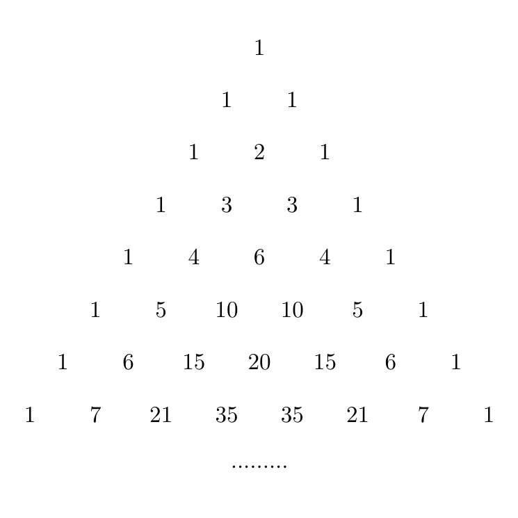

# 203 : 無平方二項係数

二項係数$$\dbinom{n}{k}$$は三角形の形に並べることができる. すなわちパスカルの三角形である. 以下を見よ.

上から$$8$$行見るとパスカルの三角形は$$12$$個の異なる数を含む. $$1, 2, 3, 4, 5, 6, 7, 10, 15, 20, 21, 35$$である.

任意の素数の二乗が$$n$$を割り切らないとき, 正整数$$n$$が平方因子を持たないと言う. 先ほどの$$12$$個の数字を見ると, $$4, 20$$ の以外は平方因子を持たない. 従って, 最初の$$8$$行の平方因子を持たない異なる数の和は$$105$$になる.

パスカルの三角形の最初の$$51$$行に含まれる平方因子を持たない異なる数の和を答えよ.
