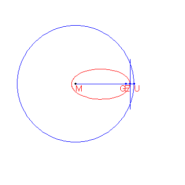

# 246 : 楕円の接線 \(\*\)

楕円の定義は以下の通り：  
中心 M と半径 r を持つ円 c と、d\(G,M\)&lt;r を満たす点 G が与えられたとき、 c と G から等距離にある点の軌跡が楕円となる。

楕円上の点の作成手順を下に示す。  
\(ToDo: アニメーションGIFが見えない\)  
（訳注：円上の点UとGの垂直二等分線と、MからUの半径との交点が楕円上の点である。）

点 M\(-2000,1500\), G\(8000,1500\) とする。  
円 c は中心が M, 半径 15000 とする。  
G と c から等距離にある点の軌跡を楕円 e とする。  
e の外の点 P から楕円に対し 2 本の接線$$t_1, t_2$$を描く。  
$$t_1, t_2$$が楕円に接する点を R, S とする。

角 RPS が 45 度より大きくなるような格子点 P はいくつあるか。

