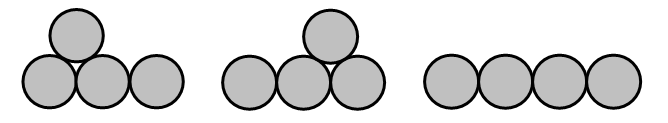

# 519 : 三色コイン噴水

隙間なく積まれた1段以上のコインの段があり、その上の段にあるコイン全てが下の段のちょうど2個のコインと接しているようなコインの配置をコインの**噴水**(fountain) と呼ぶ。$$n$$個のコインによる配置可能な噴水の数を $$f(n)$$ としよう。4個のコインの場合3個の可能な配置がある：

よって$$f(4) = 3$$ である。そしてさらに $$f(10) = 78$$ となる。

$$n$$ 個のコインによる $$f(n)$$ 個の噴水全てを、2個の接するコインが同じ色にならないという条件のもとに三色に塗り分ける配色の数を $$T(n)$$ としよう。4個のコインからなる3個の妥当な噴水のうちの1つに対する可能な塗り分け方は以下のようになる：

.png>)

$$T(4) = 48$$ そして $$T(10) = 17760$$ が与えられている。

$$T(20000)$$ の末尾9桁を求めよ。
